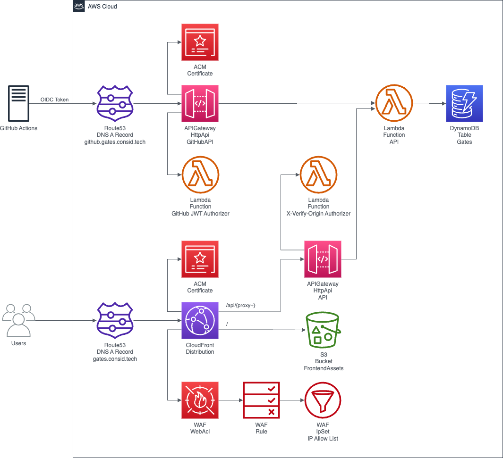

# gates

[](https://github.com/consid-germany/gates/actions/workflows/ci.yaml)
[](https://github.com/consid-germany/gates/actions/workflows/release.yaml)

**gates** is a tool to assist software development 
teams in managing the deployment of software artifacts across multiple pipelines and environments.
The tool provides toggles called gates which can be in the state `open` or `closed`
to control whether a deployment or pipeline should proceed or not.

A gates application comprises the following three components:

1. **api**: HTTP API to create, list and update gates and their states. The API is implemented as a serverless application with Rust, AWS Lambda and the AWS API Gateway. The gates are stored in an AWS DynamoDB table.
2. **ui**: Web frontend providing a user interface to view and toggle gates as well as to add comments to gates (useful to indicate why a gate is in a certain state).
3. **action**: GitHub Action which can be used within GitHub Action workflows to check the state of a gate and stop the pipeline if the gate is in `closed` state.

## Demo

You can check out a demo of the gates ui here: https://gates.consid.tech.

*Note that this is a demo deployment of the gates application which replaces comment messages with sanitized default messages and does not allow to
create or delete gates.*


## Quick Start - GitHub Action

To use gates within your GitHub deployment pipeline you can simply use the ***consid-germany/gates*** action as shown in the block below.
The parameters explained:

- `gitHubApiBaseUrl`: URL of the GitHub API of your gates deployment.
- `group`, `service`, `environment`: Required and used to specify the gate of which the gate state is checked during the workflow execution. 
 
If the gate state is `open`, the workflow will proceed. If the gate state is `closed` the action will set an error to cancel the workflow.

```yaml
jobs:
  example:
    permissions:
      id-token: write
    runs-on: ubuntu-latest
    steps:
      - uses: consid-germany/gates@v1.3.0
        with:
          gitHubApiBaseUrl: https://github.gates.consid.tech/api
          group: some-group
          service: some-service
          environment: test
```

## Quick Start - AWS Deployment

The simplest and fastest way to get your own deployment of the gates application 
is to deploy the stack in your AWS account with the provided AWS CDK construct. Follow the instructions below.

### 1) Prerequisites

In order to deploy the gates application to your AWS account, you will need to meet the following requirements:

- AWS Account with [CDK Bootstrapping](https://docs.aws.amazon.com/cdk/v2/guide/bootstrapping.html) (`us-east-1` region is required to be bootstrapped)
- [AWS CLI](https://docs.aws.amazon.com/cli/latest/userguide/getting-started-install.html) with [configured credentials](https://docs.aws.amazon.com/cli/latest/reference/configure/) for your AWS Account
- [Node.js & npm](https://nodejs.org/en/download)

### 2) Create a new CDK app project

Create a new AWS CDK project using the AWS CDK CLI `cdk init` command:

```bash
npx cdk@latest init app --language typescript
```

### 3) Install the `@consid-germany/gates` package

Install the `@consid-germany/gates` npm package which contains the AWS CDK construct.

```bash
npm install -D @consid-germany/gates
```

### 4) Create stack and `Gates` construct

Inside your CDK app or stack (see `bin` or `lib` directory), import the `Gates` construct from the `@consid-germany/gates` 
package and create it.
The `Gates` construct needs to be created within a stack that has an environment (`env`) configuration providing the `region` and `account` of 
the target AWS account where the application should be deployed.

Example stack to use with your CDK application (see app created in the `bin` directory):

```ts
import * as cdk from "aws-cdk-lib";
import { Gates } from "@consid-germany/gates";

const app = new cdk.App();

const stack = new cdk.Stack(app, 'Stack', {
    env: {
        region: "eu-central-1", // replace with the region where you want to deploy the stack
        account: "1234567890",  // replace with your AWS account id
    }
});

new Gates(stack, "Gates", {
    gitHubApi: {
        allowedSubPatterns: [
            "repo:consid-germany/gates:*"   // replace with your repositories
        ]
    },
});
```

### 5) Deploy the app

Run the following command to deploy the gates application stacks into your AWS account:

```bash
npx cdk@latest deploy --all
```

## Infrastructure Overview

When deploying the gates application using the gates AWS CDK construct, there are a few AWS cloud resources which will be created:

- AWS Lambda function for the API and a AWS DynamoDB table where gates are stored.
- DNS record for the GitHub API (e.g. `github.gates.consid.tech`), which will be routed to an API Gateway (HttpApi). An ACM certificate is created and attached to the HttpApi. The HttpApi uses an AWS Lambda function to validate the JWT OIDC GitHub token which will be included in requests of the GitHub Action workflows using the ***consid-germany/gates*** action. When a request is valid, the API Lambda function will be called with the request and the response of the function is returned.
- DNS record for the API & UI (e.g. `gates.consid.tech`), which will be routed to a CloudFront distribution. A global ACM certificate is created and attached to the CloudFront distribution. The CloudFront distribution uses a global AWS WAF (Web Application Firewall) utilizing a WAF rule and a WAF IpSet to restrict access to the content for a custom set of IP addresses.
  - Requests to `/api` and any sub route `/api/{proxy+}` will be redirected to an API Gateway (HttpApi). To only allow the CloudFront distrbution to be able to access the HttpApi, the HttpApi will use an AWS Lambda function to validate an HTTP Header (`x-verify-origin`) which will be included in the redirected requests by the CloudFront distribution with a secret value. When a request is valid, the API Lambda function will be called with the request and the response of the function is returned.
  - Any other request will be redirected to the UI (provided via static frontend assets in a S3 Bucket).



## Contributing

All types of contributions are encouraged and valued. 
Check out the [Contributing](https://github.com/consid-germany/gates/blob/main/CONTRIBUTING.md) file for more information
about how to contribute as well as for detailed information about setting up the local development environment for the different
components of gates.

## Acknowledgements

The gates project is heavily inspired by the great [gatekeeper](https://github.com/otto-de/gatekeeper) tool developed at OTTO (GmbH & Co. KG).